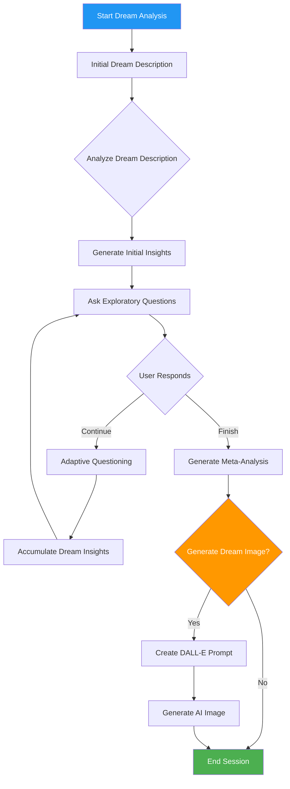

# 🌙 Dream Analysis and Image Generation Agent

## Overview
This Python-based Dream Analysis Agent is an innovative tool that helps users explore and understand their dreams through interactive questioning, meta-analysis, and AI-powered image generation.

## Features
- Interactive dream exploration
- Adaptive questioning based on dream details
- Meta-analysis of dream insights
- AI-generated image representation of dreams
- Automatic logging of dream conversations
- Image generation using DALL-E 3

## Dream Analysis Process Flowchart



## Prerequisites
- Python 3.8+
- OpenAI API Key
- Required Libraries:
  - langchain
  - openai
  - requests

## Installation

1. Clone the repository:
```bash
git clone https://github.com/yourusername/dream-analysis-agent.git
cd dream-analysis-agent
```

2. Install required dependencies:
```bash
pip install langchain openai requests
```

3. Set up your OpenAI API Key:
```bash
export OPENAI_API_KEY='your-api-key-here'
```

## Usage

Run the script:
```bash
python dream_analysis_agent.py
```

## Sample Input and Output

### Sample Dream Description:
```
I was walking in a dense forest at night. The trees were tall and shadowy, 
and I could hear distant whispers. Suddenly, a white wolf appeared, 
looking directly at me with piercing blue eyes. I felt both scared and 
strangely calm.
```

### Expected Output Flow:
```
🌙 Dream Analysis Exploration 🌙
Dream Analyst: [I was on another planet]
Dream Analyst: What was the most vivid image in your dream?
You: [There was a moon infront of me]
Dream Analyst: [it was like the moon was on the horizon]

--- Dream Insights ---
[Meta-Analysis of Dream Themes]

Would you like an image representation of your dream? (yes/no)
```

### Generated Image


## Project Structure
- `main.py`: Core dream analysis logic
- `dream_logs/`: Directory for saved dream conversations
- `dream_images/`: Directory for generated dream images

## Technical Components
- LangChain for conversational AI
- OpenAI for language model and image generation
- Modular design with separate analysis chains

## Contributing
1. Fork the repository
2. Create your feature branch
3. Commit your changes
4. Push to the branch
5. Create a Pull Request


## Disclaimer
This tool is for exploratory and entertainment purposes. It is not a substitute for professional psychological counseling.

---

**Note:** Requires an active OpenAI API key for full functionality.
